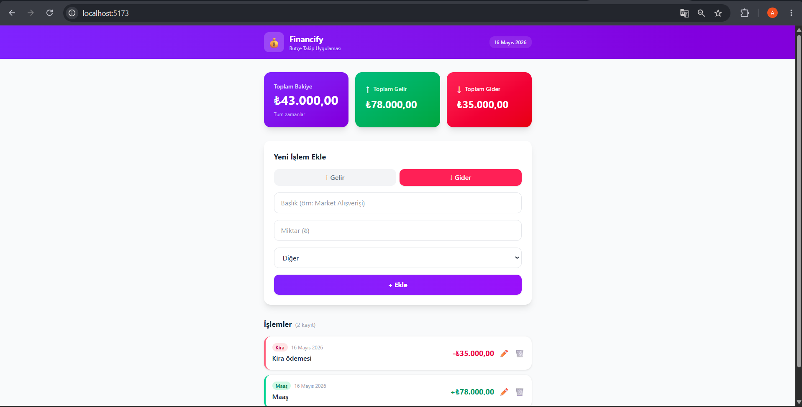

# 💰 Financify — Bütçe Takip Uygulaması

Financify, gelir ve giderlerinizi kolayca takip etmenizi sağlayan modern bir bütçe yönetim uygulamasıdır. ReactJS ve Tailwind CSS kullanılarak geliştirilmiştir.

## 🌐 Canlı Demo

[Financify'ı Görüntüle](https://financify-ver1.netlify.app/)

## 📸 Ekran Görüntüsü



## 🚀 Özellikler

- ✅ Gelir ve gider ekleme
- ✅ Tüm işlemleri listeleme
- ✅ İşlem güncelleme
- ✅ İşlem silme
- ✅ Toplam bakiye, gelir ve gider kartları
- ✅ Kategori bazlı işlem takibi
- ✅ LocalStorage ile veri saklama
- ✅ JSONPlaceholder API'den örnek veri çekme
- ✅ Mobil uyumlu tasarım

## 📦 Kurulum

```bash
# Bağımlılıkları yükle
npm install

# Geliştirme sunucusunu başlat
npm run dev
```

## 🌐 Deploy (Netlify)

1. GitHub'a push et
2. Netlify'da "New site from Git" seç
3. GitHub reposunu bağla
4. Build komutu: `npm run build`
5. Publish dizini: `dist`

## 📁 Proje Yapısı
src/
├── components/
│   ├── BalanceCard.jsx       # Bakiye kartları
│   ├── Navbar.jsx            # Üst menü
│   ├── TransactionForm.jsx   # İşlem ekleme formu
│   └── TransactionItem.jsx   # İşlem kartı (güncelle/sil)
├── pages/
│   └── Dashboard.jsx         # Ana sayfa
├── interfaces/
│   ├── transaction.js        # Veri yapısı ve kategoriler
│   └── useTransactions.js    # CRUD işlemleri hook'u
├── App.jsx
└── main.jsx

## 🔧 Teknolojiler

- **ReactJS** — UI kütüphanesi
- **Vite** — Build tool
- **Tailwind CSS** — Stil kütüphanesi
- **LocalStorage** — Veri saklama
- **JSONPlaceholder API** — Örnek veri kaynağı

## 📝 API

Uygulama ilk açıldığında JSONPlaceholder'dan örnek veriler çekilir:

- GET: `https://jsonplaceholder.typicode.com/posts?_limit=6`